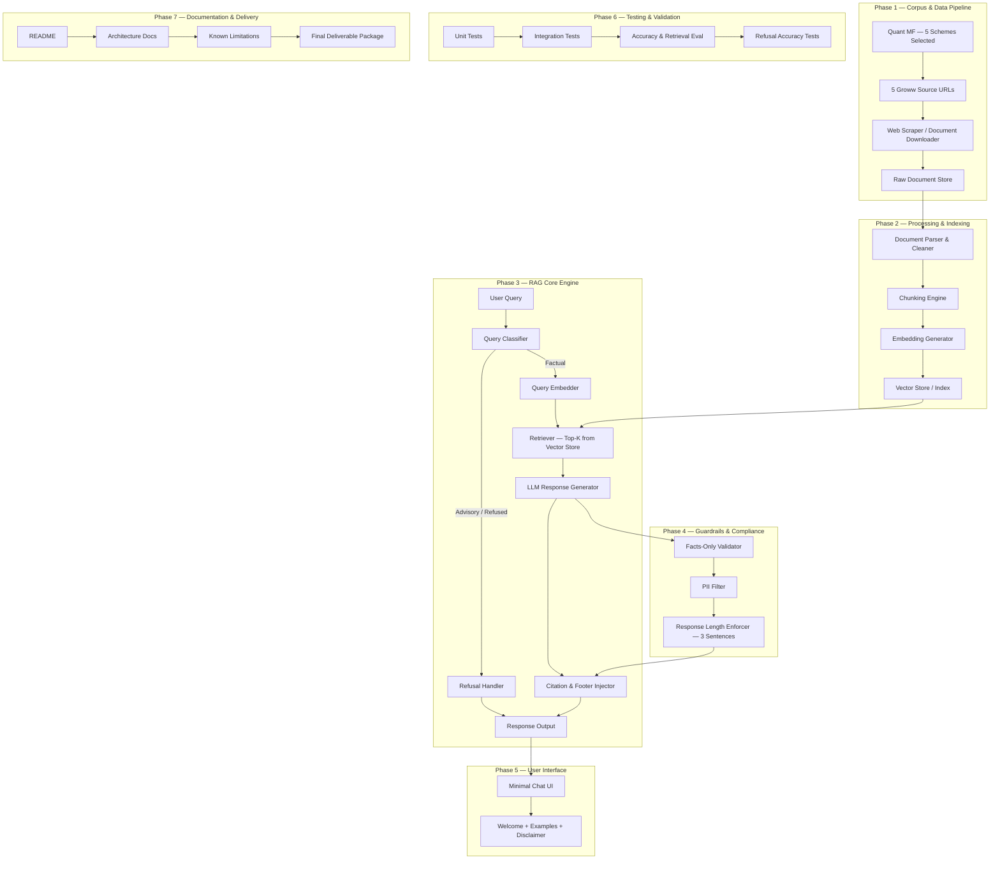
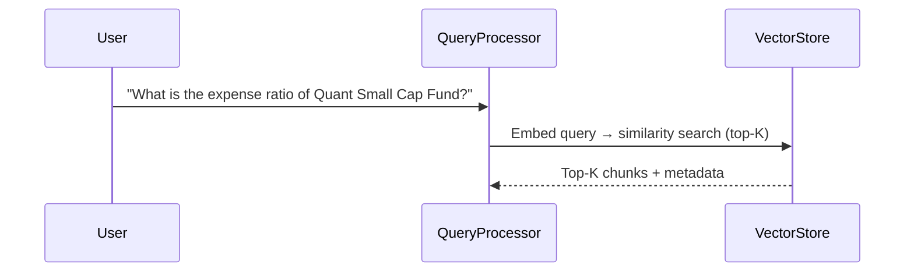
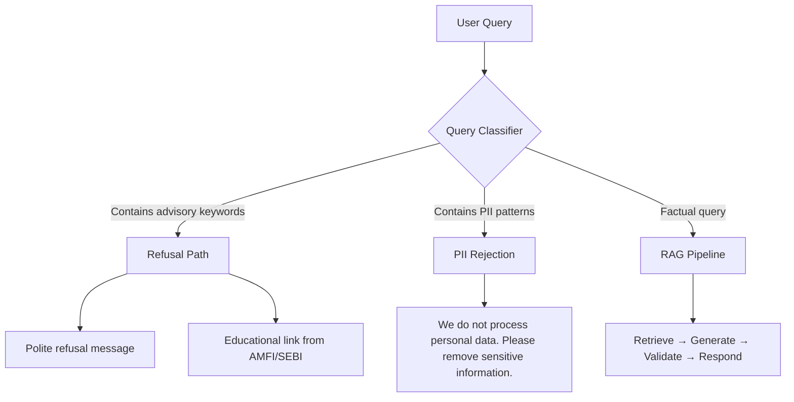
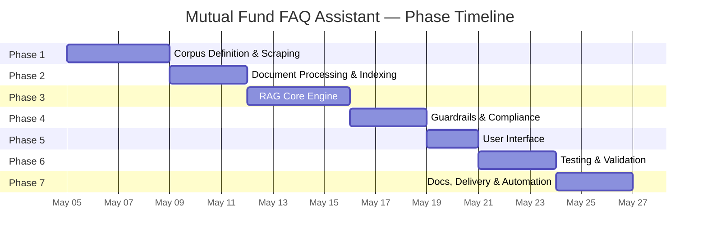

# Phase-Wise Architecture Plan — Mutual Fund FAQ Assistant

> **Project:** Facts-Only Mutual Fund FAQ Assistant (Groww Context)
> **AMC:** Quant Mutual Fund
> **Approach:** Retrieval-Augmented Generation (RAG)
> **Date:** 2026-05-03

---

## High-Level Architecture Diagram



---

## Phase 1 — Corpus Definition & Data Collection

### Objective
Scrape and store data from the 5 pre-selected Quant Mutual Fund scheme pages on Groww.

### Selected AMC
**Quant Mutual Fund** (Quant Money Managers Limited)

### Selected Schemes (5)

| # | Scheme Name | Category | Groww URL |
|---|-------------|----------|----------|
| 1 | Quant Small Cap Fund – Direct Plan Growth | Small Cap | [Link](https://groww.in/mutual-funds/quant-small-cap-fund-direct-plan-growth) |
| 2 | Quant ELSS Tax Saver Fund – Direct Growth | ELSS (Tax Saver) | [Link](https://groww.in/mutual-funds/quant-elss-tax-saver-fund-direct-growth) |
| 3 | Quant Multi Asset Allocation Fund – Direct Growth | Multi Asset / Hybrid | [Link](https://groww.in/mutual-funds/quant-multi-asset-allocation-fund-direct-growth) |
| 4 | Quant Mid Cap Fund – Direct Growth | Mid Cap | [Link](https://groww.in/mutual-funds/quant-mid-cap-fund-direct-growth) |
| 5 | Quant Flexi Cap Fund – Direct Growth | Flexi Cap | [Link](https://groww.in/mutual-funds/quant-flexi-cap-fund-direct-growth) |

### Source URLs (5 — Groww scheme pages)
```
https://groww.in/mutual-funds/quant-small-cap-fund-direct-plan-growth
https://groww.in/mutual-funds/quant-elss-tax-saver-fund-direct-growth
https://groww.in/mutual-funds/quant-multi-asset-allocation-fund-direct-growth
https://groww.in/mutual-funds/quant-mid-cap-fund-direct-growth
https://groww.in/mutual-funds/quant-flexi-cap-fund-direct-growth
```

---

### Sub-Phase 1.A — Corpus URL Manifest & Metadata Schema
**Focus:** Finalize and persist the URL list and define the metadata structure.

| Task | Details | Output |
|------|---------|--------|
| Create `corpus_urls.json` | Store the 5 Groww URLs in a structured JSON file | `scraper/corpus_urls.json` |
| Define metadata schema | Fields: `source_url`, `scheme_name`, `category`, `document_type`, `scrape_date` | Schema documented |

**Deliverables:** `corpus_urls.json`, metadata schema definition

**Gate ✅**
- [ ] JSON file contains all 5 URLs and is valid
- [ ] Metadata schema covers all required fields

---

### Sub-Phase 1.B — Web Scraper Development
**Focus:** Build and run the scraper to extract content from all 5 Groww scheme pages.

| Task | Details | Output |
|------|---------|--------|
| Build scraper script | Python script using `requests` + `BeautifulSoup` or `Playwright` | `scraper/scraper.py` |
| Extract scheme data | Expense ratio, exit load, min SIP, riskometer, benchmark, fund manager, AUM, NAV, lock-in, category | Raw HTML / text per scheme |
| Store raw data | Save extracted content to `data/raw/` (one file per scheme) | 5 raw data files |
| Generate metadata | Populate `source_metadata.json` with scrape date and source info | `scraper/source_metadata.json` |

**Data to Extract Per Scheme Page:**
- Expense ratio
- Exit load details
- Minimum SIP / lumpsum amount
- Riskometer classification
- Benchmark index
- Fund manager details
- AUM (Assets Under Management)
- NAV history
- ELSS lock-in period (where applicable)
- Category & sub-category

**Deliverables:** `scraper/scraper.py`, `data/raw/` (5 files), `source_metadata.json`

**Gate ✅**
- [ ] All 5 Groww URLs are accessible and return valid content
- [ ] Scraper successfully extracts content from all 5 scheme pages
- [ ] Raw data stored for each scheme with correct metadata
- [ ] Source metadata JSON is complete and accurate

---

## Phase 2 — Document Processing & Vector Indexing

### Objective
Parse, clean, chunk, embed, and index all collected documents into a searchable vector store.

### Technology Choices
| Component | Recommended | Alternative |
|-----------|-------------|-------------|
| HTML Parser | `BeautifulSoup` | `trafilatura` |
| Embeddings | `sentence-transformers` (all-MiniLM-L6-v2) | OpenAI `text-embedding-3-small` |
| Vector Store | ChromaDB (local) | FAISS / Pinecone |

---

### Sub-Phase 2.A — Document Parsing & Cleaning
**Focus:** Extract clean text from raw HTML, remove boilerplate, and scan for PII.

| Task | Details | Output |
|------|---------|--------|
| Parse raw HTML | Extract meaningful text from the 5 raw scheme files | Clean text files |
| Remove boilerplate | Strip navigation, headers, footers, ads, scripts | Cleaned corpus |
| PII scan | Ensure no PAN, Aadhaar, account numbers, OTPs, emails, or phone numbers exist | PII-clean corpus |

**Deliverables:** `processing/parser.py`, `processing/cleaner.py`, `data/processed/` (cleaned text files)

**Gate ✅**
- [ ] All 5 documents parsed and cleaned successfully
- [ ] PII scan passes with zero detections

---

### Sub-Phase 2.B — Chunking
**Focus:** Split cleaned documents into semantically meaningful chunks with metadata.

| Task | Details | Output |
|------|---------|--------|
| Implement chunking logic | Split by sections, 300–500 tokens per chunk, with overlap | Chunk objects |
| Attach metadata | Each chunk tagged with: `scheme_name`, `section`, `source_url`, `scrape_date` | Metadata-enriched chunks |

```
┌─────────────────────────────────────────┐
│  Raw Document                           │
│  ┌───────────────────────────────────┐  │
│  │ Section: Expense Ratio            │  │
│  │ → Chunk A (300-500 tokens)        │  │
│  │   metadata: {scheme, section,     │  │
│  │              source_url, date}    │  │
│  ├───────────────────────────────────┤  │
│  │ Section: Exit Load Policy         │  │
│  │ → Chunk B (300-500 tokens)        │  │
│  │   metadata: {scheme, section,     │  │
│  │              source_url, date}    │  │
│  └───────────────────────────────────┘  │
└─────────────────────────────────────────┘
```

**Deliverables:** `processing/chunker.py`, chunked JSON files in `data/processed/`

**Gate ✅**
- [ ] Chunks are 300–500 tokens with proper overlap
- [ ] Each chunk has complete metadata attached

---

### Sub-Phase 2.C — Embedding & Vector Store Indexing
**Focus:** Generate vector embeddings for all chunks and persist them in a queryable vector store.

| Task | Details | Output |
|------|---------|--------|
| Generate embeddings | Use `sentence-transformers` (all-MiniLM-L6-v2) to embed each chunk | Embedding vectors |
| Set up ChromaDB | Initialize and configure local ChromaDB instance | Vector store ready |
| Index all chunks | Store embeddings + metadata in ChromaDB | Searchable index |
| Validate retrieval | Run 5 sample queries to verify relevant chunks are returned | Validation report |

**Deliverables:** `vectorstore/` (persisted ChromaDB index), embedding pipeline script

**Gate ✅**
- [ ] All chunks embedded and indexed
- [ ] Vector store is queryable and returns relevant results for sample queries

---

## Phase 3 — RAG Core Engine (Retrieval + Generation)

### Objective
Build the core retrieval-augmented generation pipeline: query embedding → retrieval → LLM response generation with citations.

### Technology Choices
| Component | Recommended | Alternative |
|-----------|-------------|-------------|
| LLM | OpenAI GPT-4o-mini | Google Gemini Flash / Ollama (local) |
| Framework | LangChain | LlamaIndex / custom |
| Orchestration | Python module | FastAPI endpoint |

---

### Sub-Phase 3.A — Retriever Module
**Focus:** Build the query → embedding → similarity search pipeline to fetch relevant chunks.

| Task | Details | Output |
|------|---------|--------|
| Query embedding | Embed user query using the same `sentence-transformers` model as corpus | Query vector |
| Similarity search | Retrieve top-K relevant chunks from ChromaDB (K=3–5) | Ranked chunk list |
| Context assembly | Combine retrieved chunks + metadata into a structured prompt context | Formatted context block |



**Deliverables:** `rag/retriever.py`, `config.py` (top-K, model settings)

**Gate ✅**
- [ ] Retriever returns relevant chunks for 10+ test queries
- [ ] Top-ranked chunk matches the correct scheme for each query

---

### Sub-Phase 3.B — LLM Integration & Prompt Engineering
**Focus:** Design the system prompt, integrate the LLM, and generate factual responses from retrieved context.

| Task | Details | Output |
|------|---------|--------|
| Design system prompt | Facts-only instructions, 3-sentence limit, no-advice rules | Prompt template |
| LLM API integration | Connect to Groq (Primary) with Google Gemini Flash free tier (Fallback) | Working LLM call |
| Response generation | Send assembled prompt → receive raw LLM answer | Raw response |

**Prompt Template:**
```
SYSTEM:
You are a facts-only mutual fund FAQ assistant. Answer using ONLY
the provided context. Do NOT give investment advice, opinions, or
recommendations. Limit your answer to 3 sentences maximum.

CONTEXT:
{retrieved_chunks}

SOURCE: {source_url}
LAST UPDATED: {source_date}

USER QUERY:
{user_question}

RULES:
1. Answer in ≤ 3 sentences using only the context above.
2. If the context does not contain the answer, say so clearly.
3. Do NOT recommend, compare, or advise.
4. End with the source citation and last-updated date.
```

**Deliverables:** `rag/generator.py`, finalized prompt template

**Gate ✅**
- [ ] LLM generates factual, ≤ 3-sentence answers from context
- [ ] No investment advice appears in any generated response

---

### Sub-Phase 3.C — Citation & Footer Injection
**Focus:** Attach the source URL and "Last updated" date to every response.

| Task | Details | Output |
|------|---------|--------|
| Citation injection | Extract `source_url` from top-ranked chunk's metadata and append | Response + citation |
| Footer injection | Append `"Last updated from sources: <date>"` using `scrape_date` from metadata | Final formatted response |
| End-to-end pipeline | Wire retriever → generator → formatter into a single callable pipeline | `rag_pipeline()` function |

**Deliverables:** `rag/formatter.py`, integrated pipeline entry point

**Gate ✅**
- [ ] Every response includes exactly one citation link
- [ ] Every response includes the "Last updated from sources" footer
- [ ] Full pipeline works end-to-end for 10+ test queries

---

## Phase 4 — Guardrails & Compliance Layer

### Objective
Implement query classification (factual vs. advisory), refusal handling, PII filtering, and response validation to ensure strict compliance with all constraints.



---

### Sub-Phase 4.A — Query Classifier
**Focus:** Classify every incoming query as `factual`, `advisory`, or `out-of-scope` before it enters the RAG pipeline.

| Task | Details | Output |
|------|---------|--------|
| Build keyword-based classifier | Match query against advisory keyword blocklist | Classification label |
| Handle edge cases | Queries that mix factual + advisory intent | Conservative classification |

```python
ADVISORY_KEYWORDS = [
    "should i", "recommend", "which is better", "best fund",
    "worth investing", "good returns", "compare performance",
    "will it grow", "safe investment", "risk worth",
    "buy or sell", "hold or exit", "switch fund"
]
```

**Deliverables:** `guardrails/classifier.py`

**Gate ✅**
- [ ] Correctly classifies 10+ advisory queries as `advisory`
- [ ] Correctly classifies 10+ factual queries as `factual`

---

### Sub-Phase 4.B — PII Filter
**Focus:** Detect and block any personally identifiable information in user input.

| Task | Details | Output |
|------|---------|--------|
| Implement regex-based PII scanner | Detect PAN, Aadhaar, phone, email, account numbers, OTPs | Detection result |
| Block PII-containing queries | Return a polite rejection message instead of processing | Rejection response |

```python
PII_PATTERNS = {
    "PAN": r"[A-Z]{5}[0-9]{4}[A-Z]",
    "Aadhaar": r"\b\d{4}\s?\d{4}\s?\d{4}\b",
    "Phone": r"\b[6-9]\d{9}\b",
    "Email": r"\b[\w.-]+@[\w.-]+\.\w+\b",
    "Account": r"\b\d{9,18}\b",
    "OTP": r"\b\d{4,6}\b"  # contextual check needed
}
```

**Deliverables:** `guardrails/pii_filter.py`

**Gate ✅**
- [ ] All PII patterns detected and blocked in user input
- [ ] No PII leaks into the RAG pipeline

---

### Sub-Phase 4.C — Refusal Handler
**Focus:** Generate polite, clearly worded refusal responses for advisory/out-of-scope queries with an educational link.

| Task | Details | Output |
|------|---------|--------|
| Build refusal template | Polite message reinforcing facts-only limitation | Refusal message |
| Attach educational link | Include AMFI/SEBI resource URL | Complete refusal response |

**Refusal Template:**
```
"I'm a facts-only assistant and cannot provide investment advice
or recommendations. For guidance on mutual fund investing, please
visit: https://www.amfiindia.com/investor-corner/knowledge-center"
```

**Deliverables:** `guardrails/refusal.py`

**Gate ✅**
- [ ] Refusal messages are polite, clear, and include educational link
- [ ] Refusal reinforces the facts-only limitation

---

### Sub-Phase 4.D — Response Validator
**Focus:** Post-LLM validation — ensure every generated response is facts-only, ≤ 3 sentences, and has a valid citation.

| Task | Details | Output |
|------|---------|--------|
| Facts-only check | Scan LLM output for advisory language; reject if found | Validated response |
| Length enforcer | Ensure response is ≤ 3 sentences; truncate if needed | Trimmed response |
| Source link validator | Verify citation URL is from an official domain (Groww/AMC/AMFI/SEBI) | Validated citation |

**Deliverables:** `guardrails/validator.py`

**Gate ✅**
- [ ] No response exceeds 3 sentences
- [ ] All citation URLs resolve to official domains
- [ ] No advisory language in any validated response

---

## Phase 5 — User Interface (Minimal Chat UI)

### Objective
Build a clean, minimal chat interface with a welcome message, example questions, and a visible disclaimer.

### Technology Recommendation
| Option | Pros | Cons | Recommended For |
|--------|------|------|-----------------|
| **Streamlit** | Fastest to build, Python-native | Limited customization | MVP / Demo |
| **Gradio** | Built-in chat component | Less control over layout | Quick prototyping |
| **HTML/JS + FastAPI** | Full control, production-ready | More effort | Production |

---

### Sub-Phase 5.A — Layout & Welcome Screen
**Focus:** Set up the UI framework and build the welcome/landing view with example questions.

| Task | Details | Output |
|------|---------|--------|
| Framework setup | Initialize Streamlit/Gradio app scaffold | `ui/app.py` |
| Welcome message | Display greeting + purpose of the assistant | Welcome section |
| Example questions | Show 3 clickable example queries | Example buttons/links |

**Deliverables:** `ui/app.py` with welcome screen

**Gate ✅**
- [ ] Welcome screen displays with 3 example questions
- [ ] App launches without errors

---

### Sub-Phase 5.B — Chat Interface & Backend Wiring
**Focus:** Build the chat input/output and wire it to the RAG + guardrails pipeline.

| Task | Details | Output |
|------|---------|--------|
| Text input + send | User types a question and submits | Input handler |
| Pipeline integration | Connect input → classifier → RAG pipeline → response display | End-to-end chat |
| Chat history | Maintain conversation history in the session | Scrollable chat |

```
┌─────────────────────────────────────────────────┐
│  🏦 Mutual Fund FAQ Assistant                   │
│─────────────────────────────────────────────────│
│                                                  │
│  Welcome! I can answer factual questions about   │
│  mutual fund schemes. Try asking:                │
│                                                  │
│  💡 "What is the expense ratio of Quant Small   │
│      Cap Fund?"                                  │
│  💡 "What is the exit load for Quant Mid Cap     │
│      Fund?"                                      │
│  💡 "What is the lock-in period for Quant ELSS   │
│      Tax Saver Fund?"                            │
│                                                  │
│  ⚠️ Facts-only. No investment advice.            │
│                                                  │
│─────────────────────────────────────────────────│
│                                                  │
│  🧑 What is the minimum SIP for Quant Flexi Cap? │
│                                                  │
│  🤖 The minimum SIP amount for Quant Flexi Cap   │
│     Fund is ₹1,000 per month. You can start a   │
│     SIP through the Groww platform or the AMC.   │
│                                                  │
│     📎 Source: https://groww.in/mutual-funds/    │
│        quant-flexi-cap-fund-direct-growth        │
│     🕐 Last updated from sources: 2026-04-15    │
│                                                  │
│─────────────────────────────────────────────────│
│  [Type your question here...          ] [Send]  │
│                                                  │
│  ⚠️ Facts-only. No investment advice.            │
└─────────────────────────────────────────────────┘
```

**Deliverables:** Functional chat interface wired to backend

**Gate ✅**
- [ ] User can type a question and receive a formatted response
- [ ] Responses flow through classifier → RAG → validator pipeline

---

### Sub-Phase 5.C — Response Formatting & Disclaimer
**Focus:** Format response output with clickable citations, "Last updated" footer, and persistent disclaimer.

| Task | Details | Output |
|------|---------|--------|
| Citation rendering | Display source URL as a clickable hyperlink | Clickable citation |
| Footer rendering | Show "Last updated from sources: <date>" below each answer | Footer text |
| Disclaimer banner | Persistent `"Facts-only. No investment advice."` visible at all times | Visible disclaimer |

**Deliverables:** Fully formatted response display, persistent disclaimer

**Gate ✅**
- [ ] Citation links are clickable
- [ ] "Last updated" footer is displayed with every response
- [ ] Disclaimer `"Facts-only. No investment advice."` is visible at all times

---

## Phase 6 — Testing & Validation

### Objective
Validate accuracy, refusal logic, compliance, and end-to-end system behavior through comprehensive testing.

### Test Matrix

| Test Category | # Cases | Pass Criteria |
|---------------|---------|---------------|
| Factual accuracy | 20+ | Correct answer matches source document |
| Citation validity | 20+ | URL is valid and from official domain |
| Refusal handling | 15+ | Advisory queries correctly refused |
| PII detection | 10+ | All PII patterns detected and blocked |
| Response length | 20+ | ≤ 3 sentences per response |
| Footer presence | 20+ | "Last updated" date present |
| Edge cases | 10+ | Graceful handling (no crash, no hallucination) |

---

### Sub-Phase 6.A — Unit Tests
**Focus:** Test each individual component in isolation.

| Task | Details | Output |
|------|---------|--------|
| Parser tests | Verify HTML parsing produces clean text | `tests/test_parser.py` |
| Chunker tests | Verify chunks are correct size with metadata | `tests/test_chunker.py` |
| Classifier tests | Verify advisory vs. factual classification | `tests/test_classifier.py` |
| PII filter tests | Verify all PII patterns are detected | `tests/test_pii_filter.py` |
| Retriever tests | Verify relevant chunks returned for queries | `tests/test_retriever.py` |

**Deliverables:** Unit test files for all core modules

**Gate ✅**
- [ ] All unit tests pass
- [ ] Each component tested with ≥ 5 test cases

---

### Sub-Phase 6.B — Integration & Accuracy Testing
**Focus:** Test the full end-to-end pipeline and measure retrieval + response accuracy.

| Task | Details | Output |
|------|---------|--------|
| E2E pipeline tests | Query → classification → retrieval → generation → formatting | `tests/test_e2e.py` |
| Factual accuracy eval | 20+ factual queries against expected answers | Accuracy score |
| Refusal accuracy eval | 15+ advisory queries must be refused | Refusal accuracy |
| Edge case testing | Ambiguous queries, multi-scheme queries, empty results | Edge case report |

```python
FACTUAL_TESTS = [
    {"query": "What is the expense ratio of Quant Small Cap Fund?",
     "expected_contains": ["expense ratio", "%"],
     "must_have_citation": True},

    {"query": "What is the exit load for Quant Mid Cap Fund?",
     "expected_contains": ["exit load"],
     "must_have_citation": True},

    {"query": "What is the lock-in period for Quant ELSS Tax Saver Fund?",
     "expected_contains": ["3 years", "lock-in"],
     "must_have_citation": True},

    {"query": "What is the minimum SIP amount for Quant Flexi Cap Fund?",
     "expected_contains": ["SIP", "minimum"],
     "must_have_citation": True},

    {"query": "What is the benchmark index for Quant Multi Asset Allocation Fund?",
     "expected_contains": ["benchmark"],
     "must_have_citation": True},
]

REFUSAL_TESTS = [
    {"query": "Should I invest in Quant Small Cap Fund?",
     "expected": "refusal"},

    {"query": "Is Quant Mid Cap better than Quant Flexi Cap?",
     "expected": "refusal"},

    {"query": "Which Quant fund gives the best returns?",
     "expected": "refusal"},
]

PII_TESTS = [
    {"query": "My PAN is ABCDE1234F, check my folio",
     "expected": "pii_rejection"},
]
```

**Deliverables:** `tests/test_e2e.py`, accuracy evaluation report

**Gate ✅**
- [ ] Factual query accuracy ≥ 85%
- [ ] Refusal accuracy = 100%
- [ ] Zero crashes on edge cases

---

### Sub-Phase 6.C — Compliance Audit
**Focus:** Final compliance sweep — verify every constraint from the problem statement is met.

| Task | Details | Output |
|------|---------|--------|
| No-advice check | Verify zero advisory responses across all test queries | Audit result |
| Citation check | Every response has exactly one valid source link | Audit result |
| Length check | Every response is ≤ 3 sentences | Audit result |
| Footer check | Every response has "Last updated from sources: <date>" | Audit result |
| PII check | No PII accepted or leaked | Audit result |

**Deliverables:** `tests/test_compliance.py`, compliance audit report

**Gate ✅**
- [ ] All responses ≤ 3 sentences with valid citation
- [ ] PII detection = 100%
- [ ] Full compliance with all problem statement constraints

---

## Phase 7 — Documentation, Delivery & Automation

### Objective
Prepare final documentation, known limitations, deliverable package, and automated data refresh.

---

### Sub-Phase 7.A — README & Documentation
**Focus:** Write the project README with setup instructions, architecture overview, and known limitations.

| Task | Details | Output |
|------|---------|--------|
| Write README.md | Overview, setup, usage, AMC/schemes, architecture, disclaimer | `README.md` |
| Architecture diagram | Visual diagram of the RAG pipeline for docs | `docs/architecture.md` |
| Known limitations | Document corpus staleness, coverage limits, PII false positives | Limitations section |
| Disclaimer | Include `"Facts-only. No investment advice."` in README + UI | Disclaimer text |

**README Structure:**
```
# Mutual Fund FAQ Assistant

## Overview
## Disclaimer
## Selected AMC & Schemes
## Architecture (RAG Approach)
## Setup Instructions
## Usage
## Known Limitations
## Tech Stack
## License
```

**Known Limitations to Document:**
- Corpus is static; requires manual re-scraping for updates
- Limited to Quant Mutual Fund and the 5 selected schemes on Groww
- Does not cover real-time NAV or live market data
- OTP-level contextual PII detection may have false positives
- Responses depend on LLM quality and may occasionally miss nuance

**Deliverables:** `README.md`, `docs/architecture.md`

**Gate ✅**
- [ ] README contains all required sections
- [ ] Architecture diagram is clear and accurate
- [ ] Known limitations are documented honestly
- [ ] Disclaimer is present in both README and UI

---

### Sub-Phase 7.B — Environment Setup & Final Review
**Focus:** Create reproducible environment config and do a final end-to-end walkthrough.

| Task | Details | Output |
|------|---------|--------|
| `requirements.txt` | Pin all dependencies with versions | `requirements.txt` |
| `.env.example` | Template for API keys and config vars | `.env.example` |
| Code cleanup | Remove dead code, add comments, consistent formatting | Clean codebase |
| Final walkthrough | End-to-end test on a fresh environment | Walkthrough pass/fail |

**Deliverables:** `requirements.txt`, `.env.example`, clean codebase

**Gate ✅**
- [ ] Setup instructions work on a fresh environment
- [ ] All dependencies are pinned and installable
- [ ] Code is clean, commented, and consistent

---

### Sub-Phase 7.C — Automated Daily Refresh
**Focus:** Implement a scheduler service using GitHub Actions to automatically run the scraping and indexing pipeline daily.

| Task | Details | Output |
|------|---------|--------|
| Workflow definition | Create GitHub Actions `.yml` to run pipeline on a CRON schedule | `.github/workflows/daily-refresh.yml` |
| Pipeline script | Single script to sequentially run Scraper -> Parser -> Chunker -> Indexer | `scripts/run_pipeline.py` |
| State persistence | Commit and push updated JSONs and ChromaDB back to the repository | Git commit action |

**Deliverables:** `.github/workflows/daily-refresh.yml`, `scripts/run_pipeline.py`

**Gate ✅**
- [ ] GitHub Actions workflow executes successfully
- [ ] Pipeline gracefully handles scraper failures without corrupting the index
- [ ] Updates to data are committed and pushed to the repository automatically

---

## Project Directory Structure

```
mutual-fund-faq-assistant/
├── README.md
├── requirements.txt
├── .env.example
├── config.py
│
├── scraper/
│   ├── scraper.py              # URL scraper / document downloader
│   ├── corpus_urls.json        # Curated source URL list
│   └── source_metadata.json    # Source metadata (URL, date, type)
│
├── data/
│   ├── raw/                    # Raw scraped documents
│   └── processed/              # Cleaned, chunked documents
│
├── processing/
│   ├── parser.py               # HTML / PDF text extraction
│   ├── cleaner.py              # Text cleaning & normalization
│   └── chunker.py              # Document chunking logic
│
├── vectorstore/
│   └── chroma_db/              # Persisted ChromaDB index
│
├── rag/
│   ├── retriever.py            # Vector similarity search
│   ├── generator.py            # LLM prompt assembly & generation
│   └── formatter.py            # Citation & footer injection
│
├── guardrails/
│   ├── classifier.py           # Query intent classifier
│   ├── refusal.py              # Refusal response generator
│   ├── pii_filter.py           # PII detection & blocking
│   └── validator.py            # Post-generation validation
│
├── ui/
│   └── app.py                  # Streamlit / Gradio chat UI
│
├── tests/
│   ├── test_retriever.py
│   ├── test_classifier.py
│   ├── test_pii_filter.py
│   ├── test_e2e.py
│   └── test_compliance.py
│
└── docs/
    ├── architecture.md
    └── phase-architecture.md   # This file
```

---

## Phase Dependency & Timeline



### Phase Dependencies
| Phase | Sub-Phases | Depends On | Can Start After |
|-------|------------|------------|------------------|
| Phase 1 | 1.A, 1.B | — | Immediately |
| Phase 2 | 2.A, 2.B, 2.C | Phase 1.B | Raw documents collected |
| Phase 3 | 3.A, 3.B, 3.C | Phase 2.C | Vector store indexed |
| Phase 4 | 4.A, 4.B, 4.C, 4.D | Phase 3.C | RAG pipeline functional |
| Phase 5 | 5.A, 5.B, 5.C | Phase 3.C + 4.D | Core engine + guardrails ready |
| Phase 6 | 6.A, 6.B, 6.C | Phase 1–5 | All components built |
| Phase 7 | 7.A, 7.B, 7.C | Phase 6.C | Testing complete |

---

## Tech Stack Summary

| Layer | Technology | Purpose |
|-------|-----------|---------|
| **Scraping** | Python, requests, BeautifulSoup, pdfplumber | Data collection |
| **Embeddings** | sentence-transformers (all-MiniLM-L6-v2) | Text → vector conversion |
| **Vector Store** | ChromaDB | Similarity search index |
| **LLM** | Groq (Llama-3) API / Gemini Flash API (Fallback) | Response generation (Zero cost) |
| **Framework** | LangChain (optional) | RAG orchestration |
| **Guardrails** | Custom Python (regex + keyword rules) | Compliance enforcement |
| **UI** | Streamlit | Minimal chat interface |
| **Testing** | pytest | Automated test suite |
| **Docs** | Markdown | Project documentation |

---

> **Next Step:** Begin **Phase 1** — AMC and schemes are finalized. Build the web scraper to extract data from the 5 Groww URLs.
